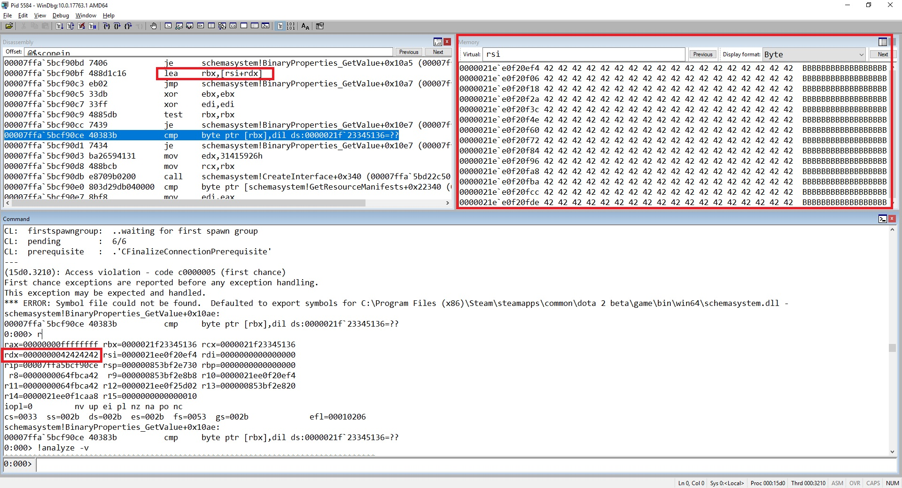
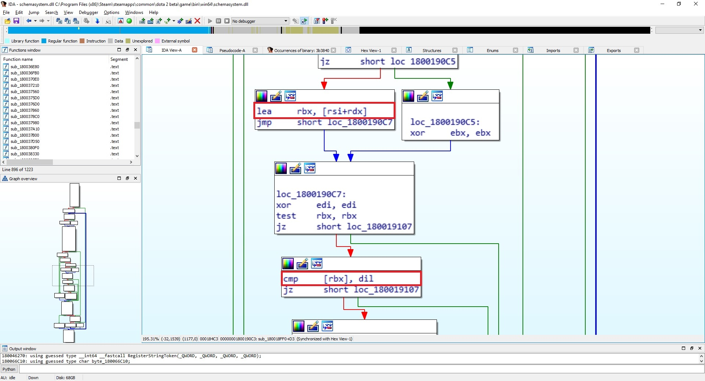

# CVE-2020-7949

Valve Dota 2 (schemasystem.dll) before 7.23f allows remote attackers to achieve code execution or denial of service by creating a gaming server and inviting a victim to this server, because a crafted map is mishandled during a GetValue call.

Attacker need invite a victim to play on attacker game server using specially crafted map or create custom game, then when initialize the game of the victim, the specially crafted map will be automatically downloaded and processed by the victim, which will lead to the possibility to exploit vulnerability. Also attacker can create custom map and upload it to [Steam](https://steamcommunity.com/sharedfiles/filedetails/?id=328258382).

## Steps for reproduce:

1) Copy attached file [zuff.vpk](zuff.zip) to map directory (C:\Program Files (x86)\Steam\steamapps\common\dota 2 beta\game\dota\maps)
2) Launch Dota2
3) Launch "zuff" map from Dota2 game console. Command for game console = map zuff
4) Dota2 is crash (Access Violation)

## Debug information:

```
(2098.1634): Access violation - code c0000005 (first chance)
First chance exceptions are reported before any exception handling.
This exception may be expected and handled.
*** ERROR: Symbol file could not be found.  Defaulted to export symbols for C:\Program Files (x86)\Steam\steamapps\common\dota 2 beta\game\bin\win64\schemasystem.dll - 
(2098.1634): Access violation - code c0000005 (!!! second chance !!!)
rax=00000000ffffffff rbx=0000027ba23dd9b6 rcx=0000027ba23dd9b6
rdx=0000000042424242 rsi=0000027b5ffb9774 rdi=0000000000000000
rip=00007ffa73af90ce rsp=000000e82bcfe900 rbp=0000000000000000
 r8=00000000412ee51c  r9=000000e82bcfea88 r10=0000027b5ffb9774
r11=00000000412ee51c r12=0000027b5ffbe582 r13=000000e82bcfe9f0
r14=0000027b5ffb5328 r15=0000000000000010
iopl=0         nv up ei pl nz na pe nc
cs=0033  ss=002b  ds=002b  es=002b  fs=0053  gs=002b             efl=00010200
schemasystem!BinaryProperties_GetValue+0x10ae:
00007ffa`73af90ce 40383b          cmp     byte ptr [rbx],dil ds:0000027b`a23dd9b6=??
```

[Full debug information](Full_dbg_info.txt)

### Code near exception:

```
00007ffa`5bcf90bf 488d1c16        lea     rbx,[rsi+rdx]
00007ffa`5bcf90c3 eb02            jmp     schemasystem!BinaryProperties_GetValue+0x10a7 (00007ffa`5bcf90c7)
00007ffa`5bcf90c5 33db            xor     ebx,ebx
00007ffa`5bcf90c7 33ff            xor     edi,edi
00007ffa`5bcf90c9 4885db          test    rbx,rbx
00007ffa`5bcf90cc 7439            je      schemasystem!BinaryProperties_GetValue+0x10e7 (00007ffa`5bcf9107)
00007ffa`5bcf90ce 40383b          cmp     byte ptr [rbx],dil ds:0000021f`23345136=??
```
This means that in the instruction at the address 0x00007ffa5bcf90bf we generate the value of the rbx register from the sum of rsi and rdx. (The rsi register pointing to the area of memory controlled by us (Debug.png); we have full control the dword of the rdx register) 

 





This allows us to intercept the program flow what could lead to remote code execution if attacker will host a malicious server will be able compromise a remote client by having them download a custom map or addons, triggering remote code execution on the victim's computer.


## Timeline: 

10.05.2019 - Report to hackerone

- ignore 

- ignore

- ignore

24.01.2020 - Disclose vulnerability details


### State of report for this vulnerability for hackerone still "triaged"
